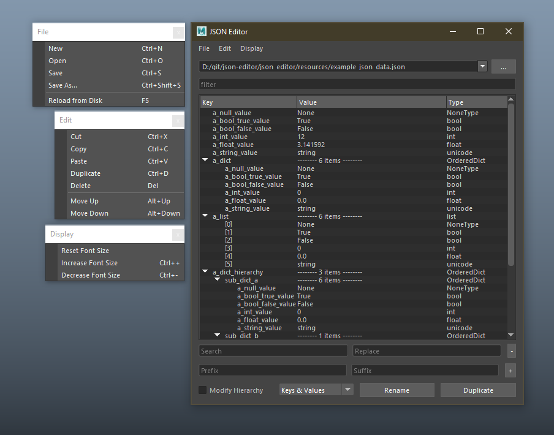

# json-editor
Visual JSON Editor written in PySide2.

# Update

2022-09-24 - Rewrote from scratch

New features:
- Can be run in a standalone python interpreter
    - compiled .exe can be found in [releases](https://github.com/rBrenick/json-editor/releases)
- Separated out the data_tree widget to its own thing
- Better handling of different data structures
- Remember indentation when saving file

# Install

<pre>
1. Download this package and unzip it in a good location 
    1.B (or git clone it directly if you have git installed)
2. Run installer.bat (will walk you through some options for install)
3. Restart the DCC
</pre>

# Start the tool
Run this script in a python tab in maya

<pre>
import json_editor
json_editor.main()
</pre>

As a developer you can run this to reload the tool without restarting

<pre>
import json_editor
json_editor.reload_modules()
json_editor.main(refresh=True)
</pre>

